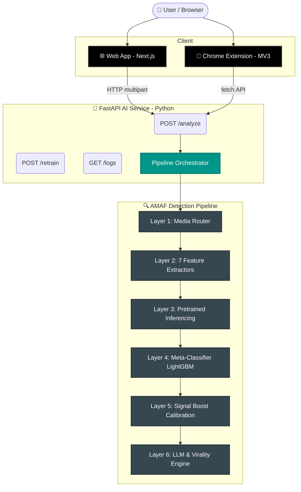

<div align="center">

# 🛡️ Reality Firewall

**Forensic-grade deepfake and AI media detection.**

[](https://nextjs.org/)
[](https://fastapi.tiangolo.com/)
[](https://www.python.org/)
[](#)

*Multi-layer authenticity analysis for images, video, and audio — with explainability, virality risk scoring, and a real-time browser extension.*

[How it Works](#-detection-pipeline--how-it-works) • [Architecture](#-system-architecture) • [Getting Started](#-running-locally) • [API](#-api-reference)

</div>

---

## 🌟 What it does

Reality Firewall detects whether an image, video, or audio file has been synthetically generated or manipulated. It answers three critical questions:

| 🎯 Objective | 📊 Output |
| :--- | :--- |
| **Is this real or fake?** | Fake probability (0–100%) + verdict |
| **Why does it look fake?** | AMAF forensic feature vector + AI explanation |
| **How dangerous is it?** | Virality score + misinformation risk + societal impact |

> 💡 **Not a "black box" binary detector.** It is a forensic analysis system that layers multiple independent signals, calibrates them, and explains its reasoning transparently.

---

## 🏗️ System Architecture

**Key Design Principle:** No single signal decides anything. Every verdict is a calibrated combination of forensic features + model outputs + signal confidence.



---

## 📁 Project Structure

```text
realityfirewall/
├── app/                          # Next.js App Router (Pages & Dashboard)
├── components/ui/                # UI Components (Meters, Heatmaps, Badges)
├── extension/                    # Chrome MV3 Extension (Context menu, Overlay)
├── ai-service/                   # Python FastAPI Backend
│   ├── feature_extractors/       # Frequency, Texture, Optical Flow, etc.
│   ├── models/                   # EfficientNet & Classifier Models
│   ├── ensemble/                 # Meta-classifier (LightGBM) & Calibration
│   ├── virality.py               # Virality & Risk Engine
│   └── llm_explanation.py        # Gemini / LLM Reasoning
└── README.md
```

---

## 🔍 Detection Pipeline — How it works

Every uploaded file goes through a multi-layered verification pipeline:

### 1️⃣ Media Router
Detects MIME type and routes to the correct sub-pipeline:
* 🖼️ **Image** → Full spatial analysis
* 🎥 **Video** → Frame extraction (1 fps adaptive) + per-frame + temporal layer
* 🎙️ **Audio** → Spectrogram analysis + spoof detection

### 2️⃣ Feature Extractors (AMAF Framework)
Seven independent forensic modules, each producing a scalar feature:

| Feature | Symbol | What it measures | Deepfake Signature |
| :--- | :---: | :--- | :--- |
| **High Freq Energy Ratio** | `HFER` | Energy in high-freq DCT bins | GAN generators suppress high-freq detail |
| **Spectral Variance Dev.** | `SVD` | Variance across frequency bands | GANs produce abnormally uniform spectra |
| **Patch Drift Index** | `PDI` | Block-level texture inconsistency | Seam artifacts at manipulation boundaries |
| **Energy Transition Kurtosis**| `ETK` | Sharpness of energy transitions | GAN artifacts cause sharp spectral jumps |
| **Pitch Var. Smoothness** | `PVSS` | Stability of fundamental freq. | TTS voices are overly smooth |
| **Spectral Flatness Dev.** | `FRD` | Deviation from white-noise | Codec fingerprints absent in AI audio |
| **Flow Acceleration Var.** | `FAV` | Frame-to-frame optical flow | Inconsistent motion fields |

### 3️⃣ Pretrained Model Inference
* **EfficientNet-B4**: Fine-tuned for deepfake classification → outputs `deepfake_prob` (0–1)
* **Identity drift**: ArcFace-style embedding comparison → outputs `identity_drift`
* **Audio spoof detector**: Spectrogram classifier → outputs `audio_spoof_prob`
* **Noise residual analysis**: Exposes GAN noise patterns → outputs `noise_score`
* **GAN spectral fingerprint**: Detects peak patterns at JPEG grid freqs → outputs `spectral_peak_score`

### 4️⃣ Meta-Classifier (LightGBM)
Features are assembled into a 14-dimensional **AMAF feature vector** and passed to a trained LightGBM gradient-boosted classifier. Missing features (e.g., image without audio) are handled natively.

### 5️⃣ Calibration & Signal Boost
* **Signal Boost:** Prevents the meta-classifier from quietly overriding strong forensic evidence.
* **Platt Scaling:** Maps the raw score to a calibrated probability using `P(fake) = sigmoid(2.5 × raw_score + 0.0)`.

### 6️⃣ Explanations & Risk Engines
* **Frequency Anomaly Heatmap:** Visualizes forensic signals like energy rings and anomaly hotspots.
* **AI Forensic Explanation:** Synthesizes signal data into a fluent text report via the Gemini API or rule-based fallback.
* **Virality Engine:** Computes spread risk and societal impact based on heuristics and fake probabilities.

<details>
<summary><strong>🧠 How Training Works & System Evolution</strong></summary>

Currently, the model trains on synthetic distributions, effectively bootstrapping its detection logic. It scales over time:
1. Every analysis is saved to the `Forensic Log Store`.
2. As verified samples accumulate, they can replace synthetic training data.
3. Live endpoints (`POST /retrain`) let you rebuild the LightGBM meta-classifier instantly based on updated distributions.
4. Upgrade directly to datasets like FaceForensics++ via custom scripts for high-accuracy generalization.

</details>

---

## 🧩 Browser Extension

The Chrome (MV3) extension enables one-click forensic analysis directly on any web page. 

1. **Right-click** any image → *"🔍 Analyze with Reality Firewall"*
2. A badge overlay appears directly on the image:
   - ✅ **Authentic** (< 35% probability)
   - ⚠️ **Suspicious** (35–65% probability)
   - ❌ **Manipulated** (> 65% probability)
   - 🌀 **Inconclusive**
3. **Hover** for quick stats or **Click** to open the full investigation dashboard.

*(To install, load the `extension/` folder as an unpacked extension via `chrome://extensions`)*

---

## 🚀 Running Locally

### Prerequisites
* **Node.js 18+**
* **Python 3.10+**
* *(Optional)* GPU with CUDA for faster video execution

### 1. Start the AI Service (FastAPI)

```bash
cd ai-service
python -m venv venv

# Windows
.\venv\Scripts\activate
# macOS/Linux: source venv/bin/activate

pip install -r requirements.txt

# Train the meta-classifier built-in model (First run only)
python train_meta.py

# Start the uvicorn server
uvicorn main:app --reload --port 8000
```

### 2. Start the Frontend (Next.js)

```bash
# In another terminal instance at the project root
npm install
npm run dev
```

Visit [`http://localhost:3000`](http://localhost:3000) to interact with the dashboard!

### ⚙️ Environment Variables

Create `.env.local` in the project root:
```env
NEXT_PUBLIC_AI_SERVICE_URL=http://localhost:8000
```

Configure `ai-service/.env` (Optional but recommended):
```env
GEMINI_API_KEY=your_gemini_api_key    # Enables Gemini LLM explanations
RF_DEVICE=auto                        # auto | cpu | cuda
RF_MAX_FRAMES=60                      # Max video frames to extract
RF_VIDEO_FPS=1.0                      # Frames per second for video sampling
```

---

## 📡 API Reference

| Method | Endpoint | Description |
| :--- | :--- | :--- |
| `POST` | `/analyze` | Analyze uploaded media file (multipart form data) |
| `GET` | `/health` | Service health & loaded models |
| `GET` | `/stats` | Analysis statistics summary |
| `GET` | `/logs` | Forensic log entries (`?limit=N&offset=M`) |
| `POST` | `/retrain` | Retrain meta-classifier (`?n_samples=N`) |
| `GET` | `/cache/stats` | LRU fingerprint cache stats |
| `DELETE` | `/cache` | Clear fingerprint cache |

---

## 🗺️ Roadmap

- [x] **Phase 1-3:** AMAF framework, feature extractors, media routing
- [x] **Phase 4:** Heatmap visualization, LLM explanation layer
- [x] **Phase 5:** LightGBM meta-classifier + calibration
- [x] **Phase 6:** Virality engine, misinformation risk, societal impact
- [x] **Phase 7:** Investigation mode, frame viewer, evidence explorer
- [x] **Phase 8:** Chrome extension (MV3), overlay badges, auto-scan
- [x] **Phase 9:** Fingerprint cache, on-demand retrain endpoint
- [x] **Phase 10:** Real labeled training data (FaceForensics++, Celeb-DF) - *See docs*
- [ ] **Phase 11:** Adversarial robustness testing
- [ ] **Phase 12:** Timeline & origin tracking (reverse image search)
- [ ] **Phase 13:** Async video queue (Redis + Celery) for long videos
- [ ] **Phase 14:** MongoDB metadata store + S3/ImageKit media storage
- [ ] **Phase 15:** Pixel-level Grad-CAM heatmaps (requires GPU backend)

---

<div align="center">
  <i>Reality Firewall is an open research platform designed to be upgraded incrementally.<br/>Swap any module with a better one, and the system adapts automatically.</i>
</div>
